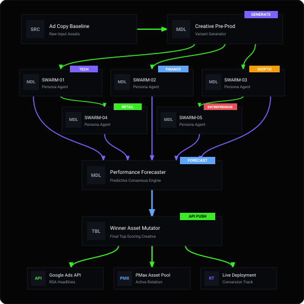

# Agent Swarms for Predictive Asset Testing

[](LICENSE)
[](https://github.com/SlavaWagner)
[](https://nodejs.org)

> **Predictive Creative Optimization Prior to Google Ads Launch**  
> Test 400 AI Ad Alternatives with an Agent Swarm of 20 Persona Test Customers before spending budget live on Google Ads.

> [!IMPORTANT]
> **Prerequisite for AI Processing:**
> Please start Google Antigravity beforehand using the command **`agy`** in your console!
> Interactive chat sessions, asset generation workflows, and AI processing run exclusively **INSIDE the Antigravity CLI**. In a standard terminal shell outside Antigravity, no AI processing takes place, and static execution outputs are intercepted with a guidance notice.

---

## Overview & Purpose

In traditional SEA and Performance Marketing, finding high-converting winning ad creatives requires launching dozens of unverified variants live on Google Ads and burning thousands of Euros in media spend to gather statistical significance.

**Agent Swarms for Predictive Asset Testing** solves this bottleneck:
1. **Mass Pre-production**: Automatically generates up to 400 cardinal AI ad alternatives (RSA & Performance Max Asset Groups) in advance based on your campaign topic and baseline ad copy.
2. **AI Asset Decision Matrix Scoring**: Applies a 6-dimensional asset vectorization (D1–D6) and scores every ad on 5 orthogonal score axes (Conversion, Audience Fit, Sentiment, Hook Interrupt, Tension Curve) to classify them into **Grades A, B, C, and D**.
3. **20-Agent Persona Swarm Testing**: Dynamically generates a swarm of 20 distinct test customer persona agents in **ENGLISH** tailored specifically to the offer, industry, and target audience derived from the ad creative.
4. **Predictive Performance Projections**: Returns qualitative persona statements alongside proportional estimations for **CTR (%)**, **CPC (€)**, **CPM (€)**, and **Cost per Lead (CPL €)**.

> **No Google Ads API Authentication Required!**  
> You can input your campaign topic, target landing page URL, and baseline ad copy directly via CLI. No API credentials or OAuth setup needed.

---

## Architecture & Core Components

<p align="center">
  
  <br>
  <em>System Circuit Architecture — <a href="docs/system-circuit.html">View interactive standalone widget</a></em>
</p>

```
 [Campaign Theme / Baseline Copy]
               │
               ▼
 ┌───────────────────────────┐
 │ 1. Mass Pre-production    │ ──► Generates 400 Cardinal AI Ad Alternatives
 └─────────────┬─────────────┘     (Asset-Spine & Unconventional Metaphors)
               │
               ▼
 ┌───────────────────────────┐
 │ 2. AI Asset Decision      │ ──► 6-D Vectorization (D1-D6) & 5 Score Axes
 │    Matrix Scoring         │     Classifies Ads into Grades A, B, C, D
 └─────────────┬─────────────┘
               │
               ▼
 ┌───────────────────────────┐
 │ 3. 20-Agent Persona       │ ──► 20 Dynamic Test Customer Sub-Audiences Evaluate Creatives
 │    Swarm Testing          │     Returns Direct Feedback & Projections in English
 └─────────────┬─────────────┘
               │
               ▼
 [Winner Ad Creatives + Projections (CTR, CPC, CPM, CPL) Ready for Launch!]
```

### 1. Mass Pre-production Engine (`PreproductionAgent`)
- **Phase 0 Angle Discovery Engine**: Prior to asset creation, the agent executes an offer-tailored Angle Search to discover **40 unique, distinct positioning angles** (story spines, buyer motivators, and situational triggers) tailored like a glove to the specific offer, industry, and landing page context.
- **High Distinction & Non-Repeating Themes**: Every single one of the 40 top evaluated candidate asset groups is built on a completely distinct angle (e.g., *Erbschafts-Wertgutachten*, *Zinswende-Rechner 2026*, *Scheidung & Konfliktfreie Bewertung*, *Sanierungsbedarf vs. GEG 2026*, *Off-Market VIP-Verkauf*, *Berliner Kiez-Analyse*, *Bodenrichtwert*, etc.) ensuring zero repeating themes across the pre-production catalog.
- **Offer-Specific Perspectives (No Framework or Tech Labels in Copy)**: Copywriting frameworks (`PAS`, `AIDA`, `FAB`, `MVP Pivot`, `Big Five`, `DISG`) serve strictly as internal psychological writing perspectives applied to the offer. No framework labels or AI/tech buzzwords (*"KI-Infrastruktur"*, *"technologischer Vorsprung"*, *"SEA-Infrastruktur"*) appear in customer-facing copy.
- **Strict Character Limit Enforcement**:
  - *Headlines*: Max 30 characters.
  - *Long Headlines (PMax)*: Max 90 characters.
  - *Descriptions*: Max 90 characters.

### 2. AI Asset Decision Matrix (`DecisionMatrix`)
Vectorizes every creative across **6 Input Dimensions**:
- **D1 – Framework**: `PAS` | `AIDA` | `FAB` | `MVP Pivot` | `Big Five` | `DISG`
- **D2 – Angle**: `ROI Proof` | `Risk Reduction` | `Speed` | `Authority` | `Scarcity` | `Status` | `Unconventional Metaphor`
- **D3 – Lifecycle Stage**: `Lead` | `Prospect` | `SAL` | `Opportunity` | `Customer`
- **D4 – Market Sophistication**: `1 (Broad)` | `2 (Aware)` | `3 (Narrow)`
- **D5 – Hook Type**: `Benefit` | `Proof` | `Urgency` | `Paradox` | `Curiosity` | `Uniqueness`
- **D6 – Sentiment**: `-1.0 ... 0 ... +1.0`

Assigns action-oriented grades:
- **Grade A (≥ 8.0)**: PMF Candidate – *Scale Up / Increase Budget*
- **Grade B (6.5 - 7.9)**: Test-Worthy – *Generate More Variants*
- **Grade C (5.0 - 6.4)**: Marginal – *Test Low Budget Only*
- **Grade D (< 5.0)**: Noise – *Kill / Archive*

### 3. The 20-Agent Persona Swarm (`AgentSwarm`)
Dynamically generates 20 test customer personas in **ENGLISH** derived directly from the ad copy, offer, branding/industry, and target audience context.

Whether testing B2B SaaS, Real Estate, Financial Services, or E-Commerce, the 20 Persona Agents adapt dynamically to evaluate ad creatives across key sub-audience archetypes:
1. `SWARM-01`: **Early Tech Adopter (m/28)** – Tech-savvy innovation driver seeking modern tech stack.
2. `SWARM-02`: **Skeptical Auditor (m/54)** – Hyper-critical, risk-averse quality controller demanding proof.
3. `SWARM-03`: **First-Time Buyer (f/32)** – Entry-level customer seeking planning security & clear pricing.
4. `SWARM-04`: **ROI-Driven Investor (m/48)** – Yield & cashflow strategist focused on metrics and ROI.
5. `SWARM-05`: **Cautious Conservative (f/42)** – Security-oriented decision maker requiring proven frameworks.
6. `SWARM-06`: **Legacy Asset Manager (m/39)** – Value preserver looking for seamless execution.
7. `SWARM-07`: **Senior Estate Planner (m/67)** – Generational wealth advisor evaluating long-term protection.
8. `SWARM-08`: **Urban Career Executive (f/35)** – Time-constrained senior manager seeking premium service.
9. `SWARM-09`: **Conservative Wealth Protector (m/61)** – Capital protection specialist focused on stability.
10. `SWARM-10`: **ESG & Sustainability Advocate (f/31)** – Sustainability specialist prioritizing future-proofing.
11. `SWARM-11`: **Value & Deal Hunter (m/44)** – Cost-performance optimizer seeking value leverage.
12. `SWARM-12`: **Commercial Portfolio Scaler (m/52)** – Multi-unit B2B investor evaluating enterprise metrics.
13. `SWARM-13`: **Suburban Relocator (f/37)** – Growth seeker looking for lifestyle and operational upgrade.
14. `SWARM-14`: **Downsizer / Best-Ager (f/64)** – Comfort advocate seeking low-maintenance simplicity.
15. `SWARM-15`: **Growth Tech Entrepreneur (m/33)** – Scaling founder seeking asymmetrical leverage.
16. `SWARM-16`: **Multi-Stakeholder Planner (f/45)** – Organizational planner balancing multi-decision-maker needs.
17. `SWARM-17`: **Passive Income Seeker (m/36)** – Hands-off customer seeking stress-free automated yield.
18. `SWARM-18`: **Prestige & Status Buyer (m/46)** – High-end buyer seeking exclusivity & brand prestige.
19. `SWARM-19`: **Value-Add Specialist (m/41)** – Hands-on growth optimizer looking for equity upside.
20. `SWARM-20`: **Institutional Board Director (f/58)** – Regulated governance officer demanding compliance.

---

## Installation & Getting Started

### 1. Install Globally via Antigravity CLI Ecosystem
```bash
npm install -g agent-swarms-predictive-asset-testing
```

### 2. Clone Repository & Run Locally
```bash
git clone https://github.com/SlavaWagner/agent-swarms-predictive-asset-testing.git
cd agent-swarms-predictive-asset-testing
npm install
```

### 3. Run Verification Test Suite
```bash
npm test
```

---

## CLI Usage & Commands

### 1. Google Ads OAuth Setup
Configure your Gemini API key and OAuth2 credentials to connect directly to your Google Ads Account:
```bash
agent-swarms-predictive-asset-testing setup
```

### CLI & Agent Command Reference

Die Ausführung erfolgt innerhalb der Google Antigravity CLI (`agy`) über folgende Befehle:

| Befehl | Beschreibung |
| :--- | :--- |
| `node bin/index.js preproduce`<br>*(Alias: `run`)* | Generiert bis zu 400 kardinale KI-Ad-Alternativen, führt die 6-D-Vektorisierung und 5-Achsen-Entscheidungsmatrix durch (Grades A–D), simuliert die 20 Persona-Agenten und berechnet die 30-Tage Holt-Winters ETS Prognose. |
| `node bin/index.js swarm-test` | Führt das 20-Agenten Persona Swarm Testing isoliert auf bestehende oder neu generierte Ad-Creatives aus und gibt Akzeptanzquoten sowie CTR/CPC/CPM/CPL-Prognosen aus. |
| `node bin/index.js agent list` | Listet alle registrierten persistenten Agenten (`PreproductionAgent`, Swarm Persona Archetypen) mit Rollen und Beschreibungen auf. |
| `node bin/index.js setup` | Interaktive Konfiguration des Gemini API Keys sowie der Standard-Kampagnenthemen und Zielseiten-URLs. |

#### Anwendungsbeispiele:

```bash
# 1. 400 RSA-Alternativen mit Persona Swarm und Landing-Page-Kontext generieren:
node bin/index.js preproduce -t "Immobilienbewertung Berlin" -k rsa -c 400 -u "https://www.slavawagner.de"

# 2. Performance Max Asset Groups mit bestehenden Headlines testen:
node bin/index.js preproduce -t "High-Ticket Lead Gen" -k pmax -c 200 -h "Exklusive Off-Market Deals" "Immobilien diskret verkaufen"

# 3. Reine 20-Agenten Schwarm-Simulation starten:
node bin/index.js swarm-test -k rsa
```

---

## Example Output

```text
=== Mass AI Ad Pre-production & 20-Agent Swarm Testing ===

Campaign Focus Theme:   Real Estate Lead Gen
Track:                  RSA
Target Quantity:        400 AI Ad Alternatives
Landing Page URL:       https://www.slavawagner.de
20-Agent Swarm Testing: ENABLED

[OK] Generated & Vectorized 400 AI Ad Alternatives!

=== AI ASSET DECISION MATRIX SCORING SUMMARY ===
Grade A (PMF Candidates / Scale Up):   231
Grade B (Test-Worthy / More Variants):  169
Grade C (Marginal / Low-Budget):        0
Grade D (Noise / Kill):                0

=== 20-AGENT DYNAMIC PERSONA SWARM (ENGLISH) ===
Derived Industry:       Real Estate & High-Ticket Investments
Derived Offer:          Asset Fortress | Exclusive PAS Strategy
Target Audience:        High-Net-Worth Investors & Property Buyers
Swarm Language:         ENGLISH (Dynamic Personas)

[WINNER] AD ALTERNATIVE TO LAUNCH: PREPROD-RSA-0016
   Matrix Grade & Score: Grade A (8.02/10)
   Swarm Approval Rate:  100% (20/20 Agents Approved)
   Proportional Metrics Projection:
     - Ø CTR:  7.7%
     - Ø CPC:  €2.90
     - Ø CPM:  €35.36
     - Ø CPL:  €70.70

--- Outtake: Top Agent Statements (Sub-Audiences) ---
• [SWARM-01] Early Tech Adopter (m/28) (Score: 7.1/10):
  "Great approach using the MVP Pivot framework. Clear value proposition and understandable call-to-action."
  [CTR: 6.91% | CPC: €2.66 | CPM: €34.15 | CPL: €69.75]
• [SWARM-03] First-Time Buyer (f/32) (Score: 8.5/10):
  "The story spin 'Transformative Appreciation' directly hits my core priority. This messaging stands out clearly from competitors!"
  [CTR: 8.38% | CPC: €2.94 | CPM: €33.45 | CPL: €65.65]

[OK] Report & Asset Catalog saved persistently to:
  storage/runs/preproduction-report-rsa-2026-08-01.json
```

---

## Make.com AI Agents Integration (Blueprints)

Zusätzlich zur CLI-Ausführung steht im Unterordner [`make-blueprints/`](make-blueprints/) ein fertiger Make.com Blueprint zur Verfügung, mit dem du die autonome Massen-Vorproduktion und das Predictive Asset Testing komplett über **Make.com mit Gemini AI Agents** ausführen kannst:

*   **[`SWA Agent Swarms for Predictive Asset Testing (Asset Creation).blueprint.json`](make-blueprints/SWA%20Agent%20Swarms%20for%20Predictive%20Asset%20Testing%20%28Asset%20Creation%29.blueprint.json)**: Vollständiges Make-Szenario zur Angle-Discovery, multimodalen Text-Asset-Erzeugung und 5-Agent Persona Swarm Simulation (inkl. CTR-, CPC-, CPM- und CPL-Prognosen).

Eine ausführliche Schritt-für-Schritt-Anleitung für den Import und die Konfiguration findest du im [Make Blueprints Guide](make-blueprints/README.md).

---

## License

Distributed under the MIT License. See [`LICENSE`](LICENSE) for details.

---

*Created with the help of Google Antigravity CLI*
